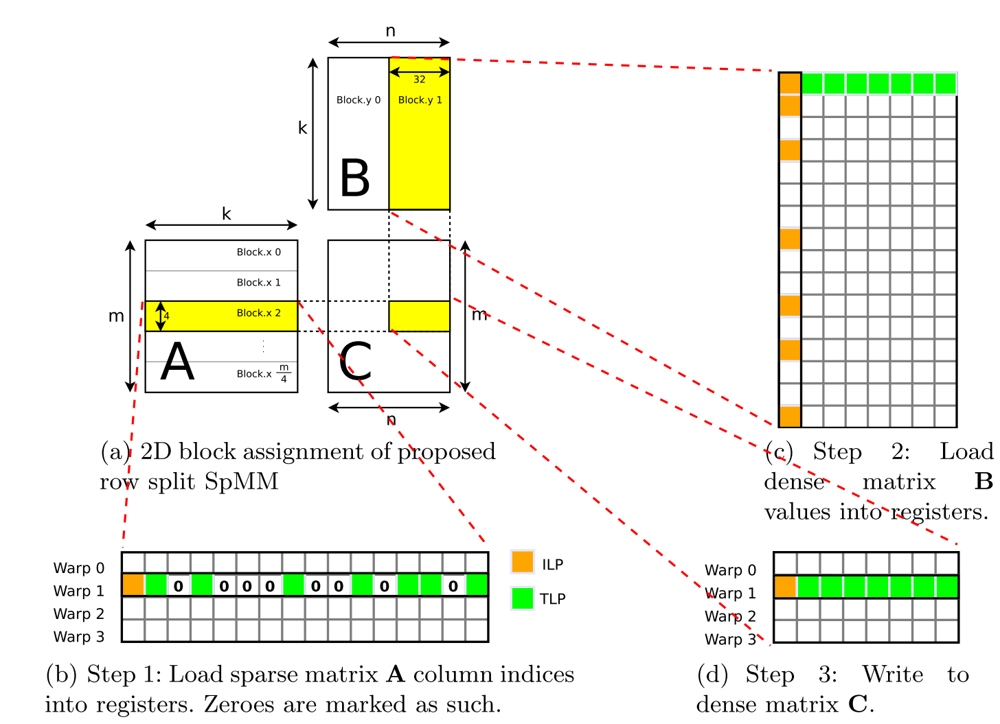
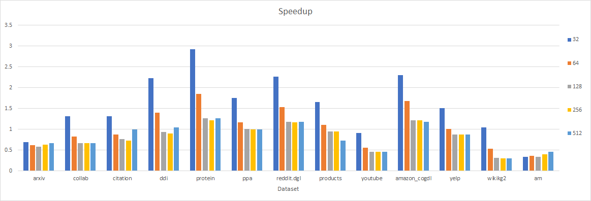

# CUDA SPMM 实验报告

## 实现方法

采用参考文献1中的row split法，代码如下所示：

```c++
__global__ void spmm_kernel_opt(int *ptr, int *idx, float *val, float *vin, float *vout, int num_v, int feat_in)
{
    int tid = blockDim.x * blockIdx.x + threadIdx.x;
    int x = tid / BLOCK_Y;
    if (x >= num_v)
        return;
    int lane_id = tid & (BLOCK_Y - 1);
    int y = blockIdx.y * BLOCK_Y + lane_id;
    int out_idx = x * feat_in + y;
    const float *vin_offset = vin + y;

    int begin = __ldg(ptr + x), end = __ldg(ptr + x + 1);

    float result = 0.f, v = 0.f;
    float val_temp[BLOCK_Y];
    float mul_temp[BLOCK_Y];
    int col_temp[BLOCK_Y];

    int ii, col;
    for (int i = begin; i < end; i += BLOCK_Y)
    {
        ii = i + lane_id;
        if (ii < end)
        {
            col = __ldg(idx + ii) * feat_in;
            v = __ldg(val + ii);
        }
        else
        {
            col = 0;
            v = 0;
        }
#pragma unroll
        for (int j = 0; j < BLOCK_Y; ++j)
        {
            col_temp[j] = __shfl_sync(0xFFFFFFFF, col, j);
            val_temp[j] = __shfl_sync(0xFFFFFFFF, v, j);
            mul_temp[j] = val_temp[j] * __ldg(vin_offset + col_temp[j]);
        }
#pragma unroll
        for (int j = 0; j < BLOCK_Y; ++j)
        {
            result += mul_temp[j];
        }
    }
    vout[out_idx] = result;
}
```



重点优化思路来自以下两点：

- **共享内存**：C每一个warp处理结果矩阵C中$1\times32$的一小块，那么这一小块属于同一行，则他们的`col_idx`，`val`可以共享，通过CUDA洗牌函数`__shfl`的形式进行广播，进而降低直接对global memory访存的次数。
- **指令级并行**：在小块内进行部分结果计算时采用循环展开的方式，并且降低指令之间的依赖，从而能够达到更好的指令并行。

注意此算法有两个可以调整的参数，一个是A矩阵分块的高度（论文里为4，我调整后选取为16），一个是B矩阵分块的宽度（论文里为32，我也一样）。

## 性能汇报

在提供的13个数据集和$len = 32, 64, 128, 256, 512$共$65-1=64$个实验设置下（citation数据集在$len=512$时会OOM），我实现的方法在30个设置中超过了`cuSPARSE`的实现。下表展示了我的方法相比`cuSPARSE`实现在各种设置下的加速比。

|              | 32       | 64       | 128      | 256      | 512      |
| ------------ | -------- | -------- | -------- | -------- | -------- |
| arxiv        | 0.685639 | 0.61624  | 0.585542 | 0.63525  | 0.664497 |
| collab       | 1.310264 | 0.822003 | 0.66805  | 0.669877 | 0.668042 |
| citation     | 1.308597 | 0.870431 | 0.769055 | 0.727401 | OOM      |
| ddi          | 2.229119 | 1.404833 | 0.936295 | 0.903875 | 1.039765 |
| protein      | 2.925236 | 1.849087 | 1.262907 | 1.211098 | 1.262204 |
| ppa          | 1.748003 | 1.162595 | 1.003925 | 1.002109 | 1.002663 |
| reddit.dgl   | 2.268179 | 1.53071  | 1.17949  | 1.166474 | 1.180755 |
| products     | 1.661279 | 1.108799 | 0.953215 | 0.944537 | 0.732012 |
| youtube      | 0.908406 | 0.562727 | 0.457478 | 0.456023 | 0.454641 |
| amazon_cogdl | 2.302614 | 1.674186 | 1.216113 | 1.216789 | 1.17469  |
| yelp         | 1.508437 | 1.011269 | 0.873742 | 0.876063 | 0.877093 |
| wikikg2      | 1.042706 | 0.529769 | 0.308868 | 0.306316 | 0.30617  |
| am           | 0.335398 | 0.365236 | 0.335423 | 0.402923 | 0.454509 |



在实验之外，我也检查我实现的方法的优势。通过柱状图可知，我实现的方法在稠密图（protein，reddit)上的表现优于在稀疏图（arxiv，am)上的表现。随着kLen的增大，我实现的方法逐渐弱于cuSPARSE的实现，这说明我实现的方法在稀疏矩阵的访存上还有提升的空间，主要问题应该还是负载不均衡。

## 参考

1. Yang C, Buluç A, Owens J D. Design principles for sparse matrix multiplication on the gpu[C]//European Conference on Parallel Processing. Springer, Cham, 2018: 672-687.
2. GE-SpMM: General-purposed Sparse Matrix-Matrix Multiplication on GPUs for Graph Neural Networks
